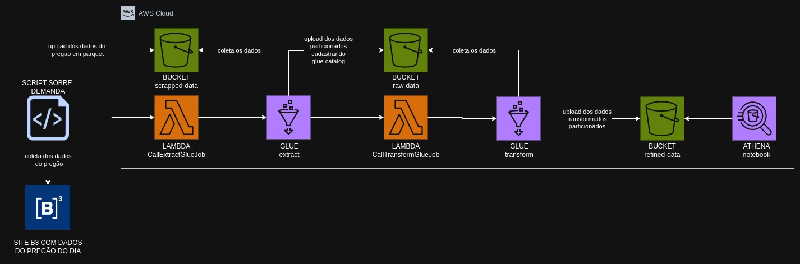

# Pipeline Batch Bovespa

Construa um pipeline de dados completo para extrair, processar e analisar dados do pregão da B3, utilizando AWS S3, Glue, Lambda e Athena.

### Requisitos

1. Scrap de dados do site da B3 com dados do pregão.
1. Os dados brutos devem ser ingeridos no s3 em formato parquet com partição diária.
1. O bucket deve acionar uma lambda, que por sua vez irá chamar o job de ETL no glue.
1. A lambda pode ser em qualquer linguagem. Ela apenas deverá iniciar o job Glue.
1. Este job deve conter as seguintes transformações obrigatórias:
    - agrupamento numérico, sumarização, contagem ou soma.
    - renomear duas colunas existentes além das de agrupamento.
    - realizar um cálculo com campos de data, exemplo, poder ser duração, comparação, diferença entre datas.
1. Os dados refinados no job glue devem ser salvos no formato parquet em uma pasta chamada refined, particionado por data e pelo nome ou abreviação da ação do pregão.
1. O job Glue deve automaticamente catalogar o dado no Glue Catalog e criar uma tabela no banco de dados default do Glue Catalog.
1. Os dados devem estar disponíveis e legíveis no Athena.
1. É opcional construir um notebook no Athena para montar uma visualização gráfica dos dados ingeridos.

### Desenho da arquitetura

